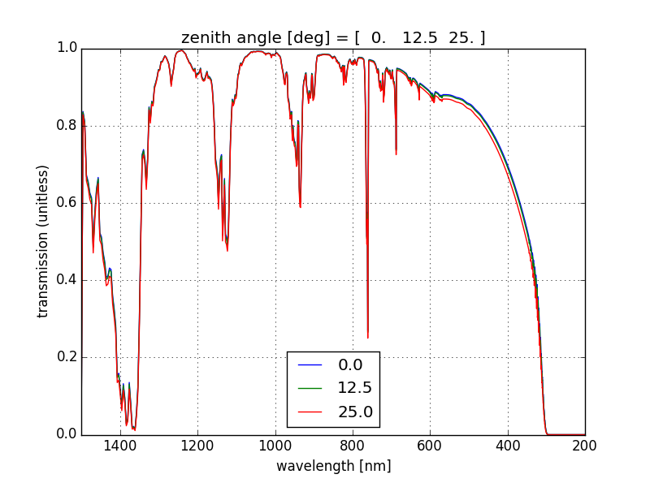
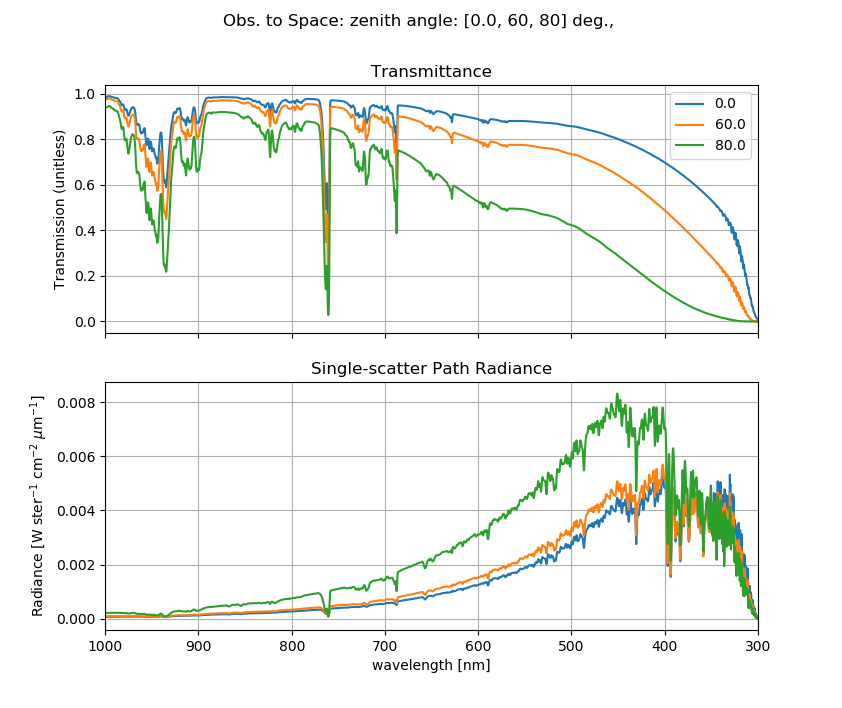
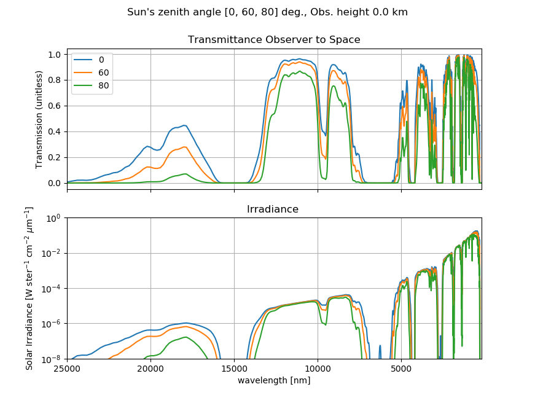
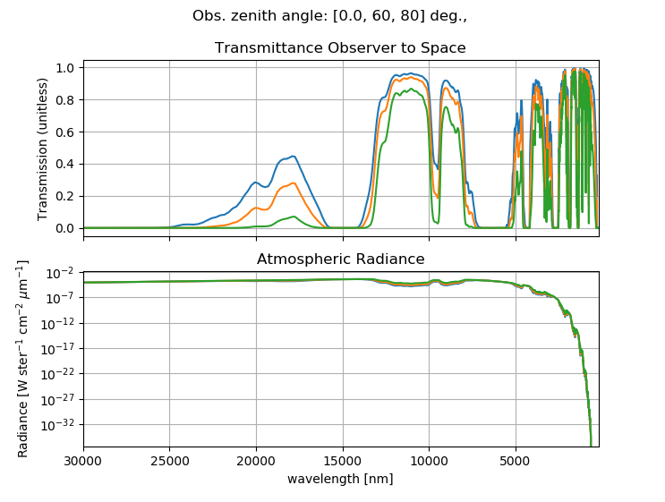

[](https://doi.org/10.5281/zenodo.213475)
[](https://travis-ci.org/scivision/lowtran)
[](https://coveralls.io/github/scivision/lowtran?branch=master)
[](https://ci.appveyor.com/project/scivision/lowtran)
[](https://pypi.python.org/pypi/lowtran)
[](https://pypi.python.org/pypi/lowtran)
[](https://codeclimate.com/github/scivision/lowtran/maintainability)
[](http://pepy.tech/project/lowtran)

# Lowtran in Python

LOWTRAN7 atmospheric absportion extinction model. Updated by Michael
Hirsch to be platform independent and easily accessible from Python.

The main LOWTRAN program has been made accessible from Python by using
direct memory transfers instead of the cumbersome and error-prone
process of writing/reading text files. xarray.Dataset high-performance
N-D array data is passed out, with all approprirate metadata.


## Gallery

See below for how to make these examples.



## Install

1. You need a Fortran compiler. If you don't have one, here is how to install Gfortran:
   
   * Linux: `apt install gfortran`
   * Mac: `brew install gcc`
   * [Windows](https://www.scivision.co/windows-gcc-gfortran-cmake-make-install/)
2. Install Python Lowtran code
   ```sh
   python -m pip install -e .
   ```

[See this page](https://www.scivision.co/f2py-running-fortran-code-in-python-on-windows)
if you have errors on Fortran compilation.

## Examples

In these examples, you can write to HDF5 with the `-o` option. 

We present examples of:

* ground-to-space transmittance: `TransmittanceGround2Space.py`

  
* sun-to-observer scattered radiance (why the sky is blue): `ScatterRadiance.py`

  
* sun-to-observer irradiance: `SolarIrradiance.py`

  
* observer-to-observer solar single-scattering solar radiance (up-going) with custom Pressure, Temperature and partial pressure for 12 species: `UserDataHorizontalRadiance.py`
  
* observer-to-observer transmittance with custom Pressure, Temperature and partial pressure for 12 species:  `UserDataHorizontalTransmittance.py`
* observer-to-observer transmittance `HorizontalTransmittance.py`

  


## Notes

LOWTRAN7 [User manual](http://www.dtic.mil/dtic/tr/fulltext/u2/a206773.pdf) -- you may refer to this to understand what parameters are set to default.
Currently I don't have any aerosols enabled for example, though it's straightforward to add them.

Right now a lot of configuration features aren't implemented, please request those you want.

### Reference

* Original 1994 Lowtran7 [Code](http://www1.ncdc.noaa.gov/pub/data/software/lowtran/)
* `LOWFIL` program in reference/lowtran7.10.f was not connected as we had previously implemented a filter function directly in  Python.
* `LOWSCAN` spectral sampling (scanning) program in `reference/lowtran7.13.f` was not connected as we had no need for coarser spectral resolution.

### Fortran (optional)

This is not necessary for normal users:

    cd bin
    cmake ..
    make
    make test

should generate [this text output](https://gist.github.com/drhirsch/89ef2060d8f15b0a60914d13a61e33ab).

### Windows f2py

(this is handled automatically by `setup.py`, noted here for debugging)

Yes, even though you're [using a 64-bit compiler](https://scivision.co/f2py-running-fortran-code-in-python-on-windows/):

    f2py --compiler=mingw32 -m lowtran7 -c lowtran7.f

Tested on Windows with
[MinGW](https://sourceforge.net/projects/mingw-w64/).

### Windows Fortran compile

Normal users don't need to do this. 
I suggest that you instead use Cygwin or Windows Subsytem for Linux:
```sh
cd bin
cmake -G "MinGW Makefiles" ..
make
make test
```
